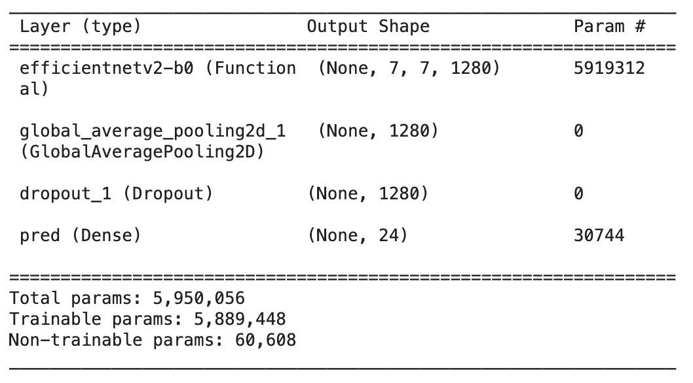
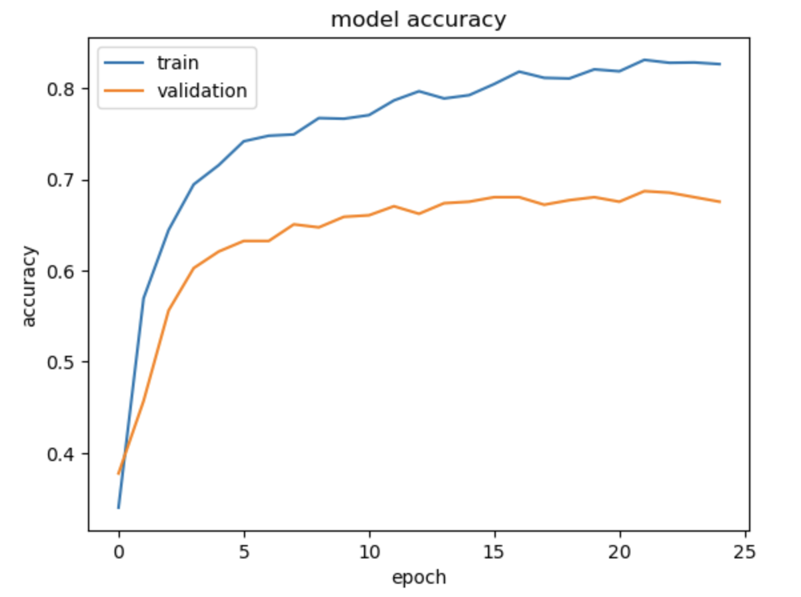
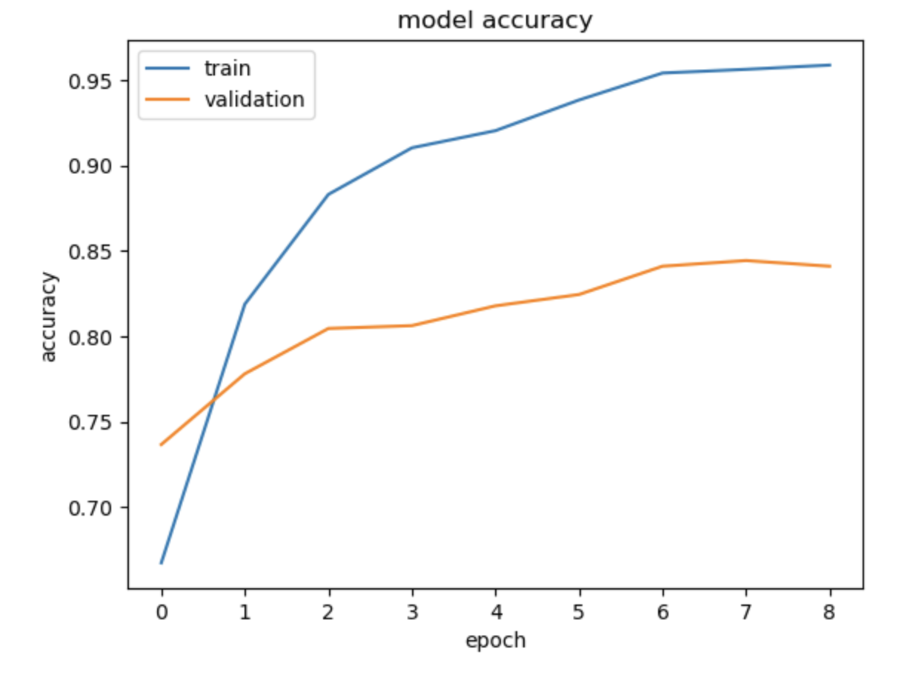

# Whats That Vehicle
WIP mobile app for classifying pictures of cars from a user's camera or photo gallery. Users can also look up a make/model by VIN and other details.

## Project Structure
```
.
├── README.md
├── model_training/
│   ├── car-brand-classification.ipynb
│   └── preprocessing_scripts/
│       ├── image_cleaner.py)
│       ├── image_to_subdirectory.sh
│       └── logo_scraper.py ...
├── research_notes.md
└── whats-that-car/ (Android app - Work in Progress)
    ├── app/ ...
```

## Current Status
Model will classify from 24 different vehicle makes with a peak of 82% accuracy.
TODO: improve upon just using car logos and diversify datasets

Summary of model (using EfficientNetV2-B0 as the base model for transfer learning).
 

Data augmentation example to increase diversity of training images


Graph comparing training accuracy ending at around 82 percent and validation accuracy at 67 percent, of a custom-trained model after fine tuning.


Improvement of validation accuracy (82 percent) and training accuracy (67 percent) after fine tuning.
